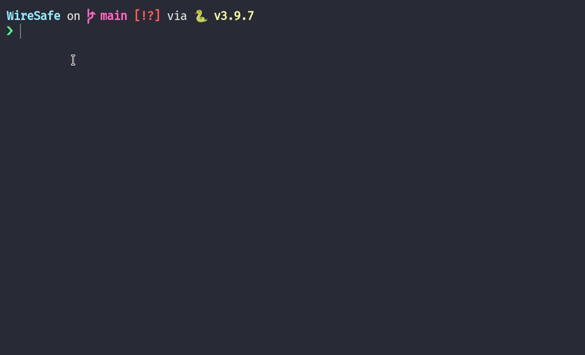

# WireSafe

> A 1-click script to deploy a Wireguard VPN server on Linode



### Inspiration

Your network traffic is visible to a lot of people. Anyone on your network, including your internet service provider can see what websites your visit, what you're doing online, and even actively downgrade your connection in an attempt to hack you. To prevent that, you need to use a VPN to actively encrypt your connection. Unfortunately, choosing an existing VPN provider like ExpressVPN or NordVPN means that you're giving them access to your network traffic. The obvious solution to this is to deploy your own VPN server, but that isn't too easy either.

### Usage

To use the script, you'll need to create a Linode API key on the dashboard. Once done, run the following in the terminal:

```sh
python wiresafe.py
```

### License

MIT
